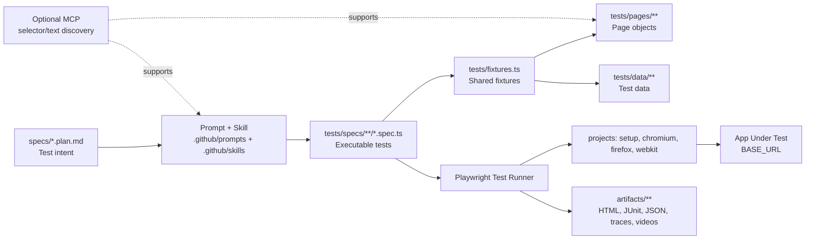
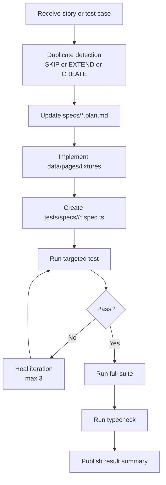

# Playwright Demo

TypeScript-first Playwright automation framework for SauceDemo, with a spec-driven workflow and optional MCP-assisted exploration.

## What This Project Includes

- Playwright projects for setup + Chromium + Firefox + WebKit
- Shared typed fixtures with injected page objects
- Spec-first planning in `specs/*.plan.md`
- Optional Playwright MCP exploration for selector/assertion discovery
- CI-friendly reporting (HTML, JUnit, JSON, traces, screenshots, videos)

## Core Principles

- Type-safe test authoring with strict TypeScript
- Stable selectors and web-first assertions
- Separation of concerns: plan files, spec files, page objects, test data
- Auth bootstrap once per run via `storageState`
- Reproducible local and CI execution

## Tech Stack

- `@playwright/test`
- `@playwright/mcp`
- `typescript` (strict)
- `dotenv`

## Project Layout

```text
playwright.config.ts        Runtime config (baseURL, projects, retries, reporters)
tsconfig.json               TypeScript strict config
specs/                      Source-of-truth test plans (*.plan.md)
tests/
  fixtures.ts               Shared fixtures (page, loginPage, checkoutPage, inventoryPage)
  seed.spec.ts              Seed/smoke anchor test
  setup/
    global.setup.ts         Setup project writes artifacts/auth/standard-user.json
  support/
    env.ts                  BASE_URL env helper
    config.ts               authStorageState + urlPatterns
  data/
    users.ts                Auth test data
    checkout.ts             Checkout test data
    inventory.ts            Inventory sorting test data
  pages/
    auth/login.page.ts
    checkout/checkout.page.ts
    inventory/inventory.page.ts
  specs/
    auth/*.spec.ts
    checkout/*.spec.ts
    inventory/*.spec.ts
.github/
  copilot-instructions.md   Repository-wide AI coding instructions
  prompts/                  Prompt entry points
  skills/                   Orchestration skills + references
  workflows/e2e.yml         CI workflow
.vscode/
  mcp.json                  MCP server config
artifacts/                  Generated outputs (reports, traces, screenshots, videos)
```

## Visual Architecture



## Quick Start

```bash
npm install
npm run setup:browsers
npm run typecheck
npm run test:e2e
```

## Environment

Copy `.env.example` to `.env`.

- `BASE_URL` (default: `https://www.saucedemo.com`)

## Auth Model

The setup project (`tests/setup/global.setup.ts`) authenticates once and writes `artifacts/auth/standard-user.json`.
Browser projects load that state for faster authenticated execution.

For login-flow tests, clear state inside the spec:

```ts
test.use({ storageState: { cookies: [], origins: [] } });
```

## Common Commands

```bash
npm run typecheck           # TypeScript validation
npm run test:e2e            # Full suite
npm run test:e2e:smoke      # @smoke subset
npm run test:e2e:ci         # CI-like run
npm run test:e2e:headed     # Headed browser mode
npm run test:e2e:ui         # Playwright UI mode
npm run test:e2e:debug      # Playwright debug mode
npm run test:e2e:report     # Open last HTML report
npm run test:seed:debug     # Debug only the seed test
```

## End-to-End Flow For A New Automation Developer

### 1. Understand The Scenario

1. Read the user story or acceptance criteria.
2. Check existing plans in `specs/*.plan.md` for overlap.
3. Decide: `SKIP`, `EXTEND`, or `CREATE`.

### 2. Author Or Extend The Plan

1. Add/update a plan in `specs/<feature>.plan.md`.
2. Keep one scenario per spec file.
3. Keep business-level steps with `- expect:` outcomes.

### 3. Implement Test Building Blocks

1. Add/update test data in `tests/data/*.ts`.
2. Add/update page object methods in `tests/pages/**`.
3. Ensure fixtures in `tests/fixtures.ts` inject required page objects.

### 4. Implement Specs

1. Create spec files in `tests/specs/<group>/`.
2. Import `test` and `expect` from `../../fixtures`.
3. Import test data from `../../data/<domain>`.
4. Add story/AC annotations when a Jira key exists.

### 5. Validate And Heal

1. Run targeted spec first:
   - `npm run test:e2e -- tests/specs/<group>/<scenario>.spec.ts`
2. If failing, apply a heal loop:
   - inspect exact failure
   - classify root cause (selector/assertion/timing/data/logic)
   - patch one focused fix
   - rerun
3. Run full suite:
   - `npm run test:e2e`
4. Run typecheck:
   - `npm run typecheck`

### 6. Deliver

1. Update plan expectations if actual UI behavior differs.
2. Summarize decision, created/updated files, run status, and typecheck status.

## Developer Flow Diagram


